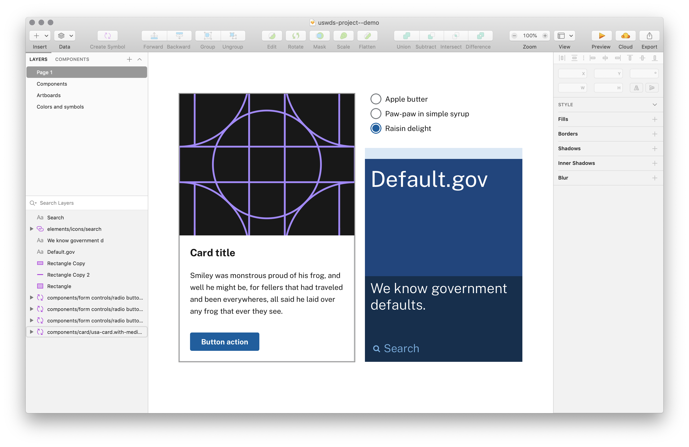
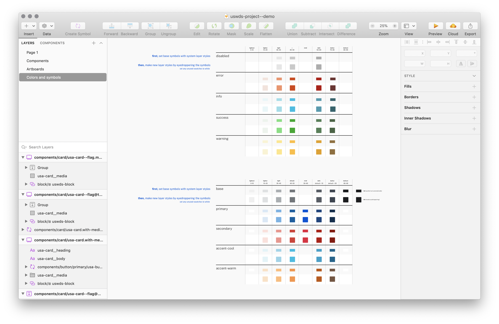
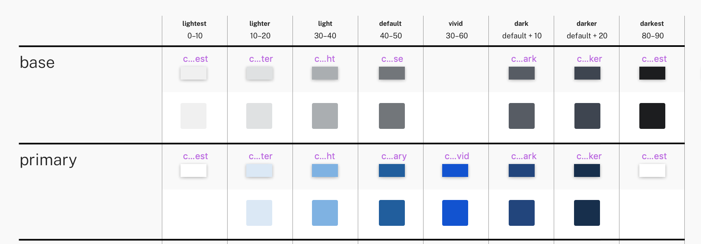
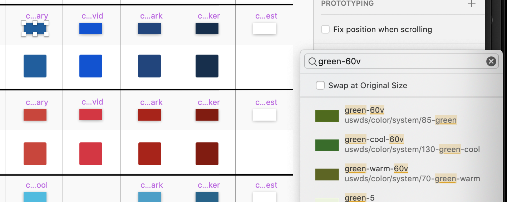
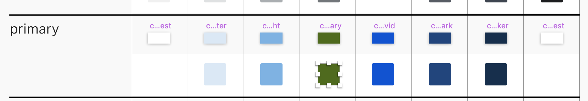
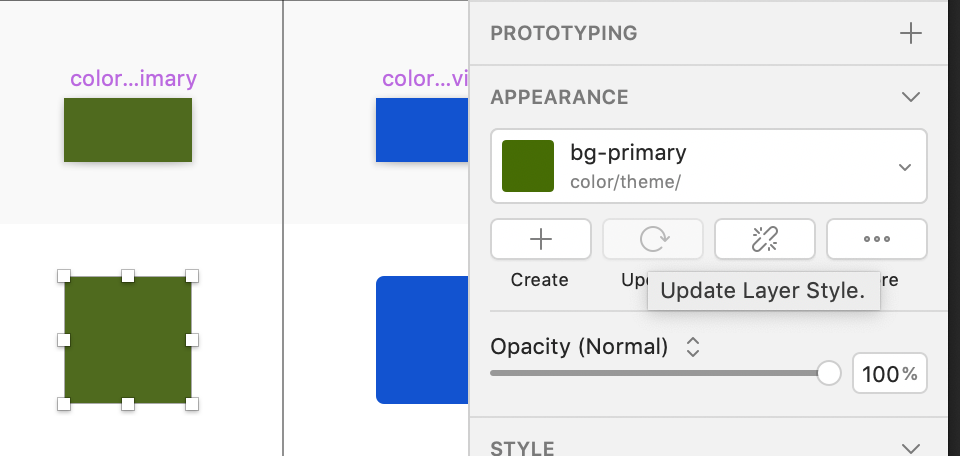
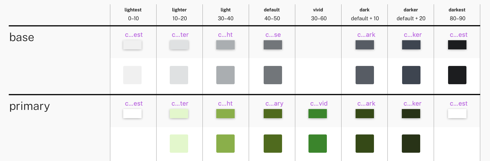
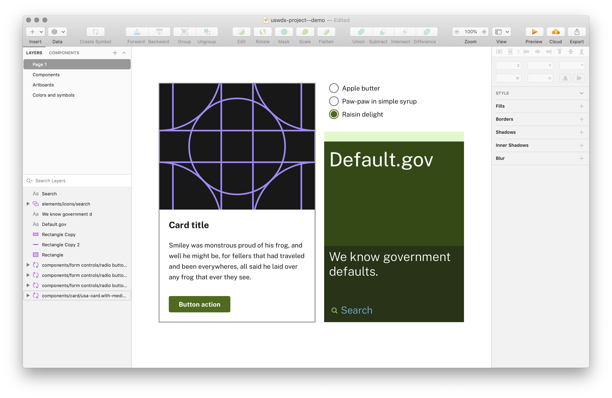
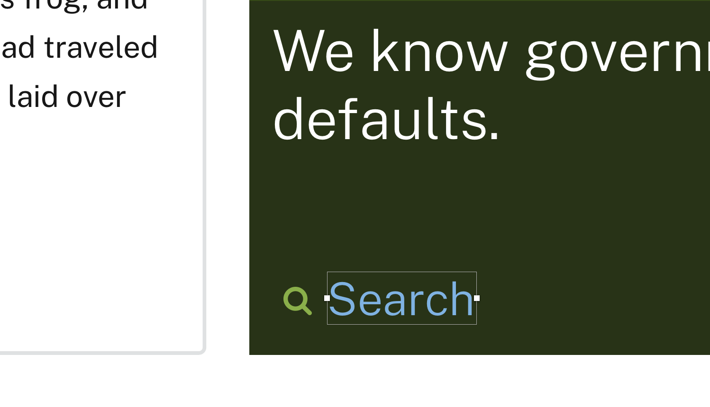

# USWDS for designers

This repository hosts editable, open source [United States Web Design System](https://designsystem.digital.gov/) design files for government designers or anyone wishing to make use of the USWDS components or visual styles.

With the release of USWDS 2.0, we've made some major changes to the way our assets are structured. **For now, these assets are only available as Sketch files for the Macintosh and as an Adobe XD file for other platforms** These files have been tested with Sketch 66 and Adobe XD 28.9.12.2.

We encourage your input. Please leave any feedback as issues in this repo.

**Note:** The USWDS team cannot support Figma yet, but there are Figma design assets developed by the USWDS community. [Read more about these Figma assets](https://truss.works/blog/uswds-figma-library) or [view the Figma component library directly](https://www.figma.com/community/file/836611771720754351).

## :beetle: May 2020: Added new components

In May 2020, we added the `Button group`, `Card`, `Character count`, and `Combo box` components to the assets.

## :tulip: April 2020: New Sketch files

In April 2020, we released a new version of the USWDS Sketch files, along with USWDS 2.7.0. This new package makes a number of improvements:

- Uses only a single library file: `uswds`
- Adds all themeable token and component symbols to a simplified `uswds-project` file
- Improves organization and navigation of USWDS components
- Provides a starting point for more flexible and customizable components using `master` component building blocks

**Note: This new version of the Sketch assets for designers replaces the older version and the two versions are not easily interoperable. You may find some quirks when trying to use the new libraries on existing USWDS projects.**

## Included design files

### Adobe XD Components

- Components and theme colors in Adobe XD format (`adobe-xd/uswds-components`).

### Sketch Libraries

The `sketch/librarires/uswds` library includes the following:

- USWDS system colors
- USWDS system typescale in Public Sans
- USWDS avatars
- USWDS block
- USWDS icons
- Helper elements like device frames
- USWDS logos

**Note: We have not yet implemented handoff symbols in the new Sketch files.**

### Sketch project file

This package includes `sketch/uswds-project`: a project file synchronized to USWDS tokens. This project file includes the following customizable elements:

- USWDS theme colors as symbols and layer styles
- USWDS components as symbols
- USWDS layout grid artboards

### Fonts

- Font Awesome
- Merriweather
- Public Sans
- Roboto Mono
- Source Sans Pro

## Before you start: Install the fonts

- Unzip the zipped packages in `fonts`.
- Add all the unzipped files (`.ttf` and `.otf` files) to your system by dragging them into the **Font Book** application. If you have older versions of these fonts, you may want to disable them in Font Book first.

Now the most recent versions of Font Awesome, Merriweather, Public Sans, Roboto Mono, and Source Sans Pro are installed and available to any program.

## Using Sketch assets

### Before you start: Install the Sketch library

- Clone or download this repo using the green `Clone or download` button in the top-right of the `uswds-for-designers` repo. This will copy the repo files to your computer. If you downloaded the files, unzip the package and move the new files to an accessible spot on your computer.
- Open Sketch > Preferences > Libraries
- Select `Add Library...`
- Select `sketch/libraries/uswds`.

Now, the USWDS library is connected to your installation of Sketch, making its styles, symbols, and colors available.

:warning: **Don't directly edit the core USWDS library file.** All USWDS system and theme libraries are designed to keep your local files in sync with most current USWDS design tokens. Don't customize the library files — rather, use the styles and symbols in the to `uswds-project` file to customize your project.

#### Updating USWDS libary and project files

Occasionally, we'll make updates to the core USWDS library or the USWDS project file and update our user with an email, a tweet, or a message to our public Slack. When you hear that there's a new release of our design assets, either pull that version from GitHub directly, or download the new assets with the provided link and replace the files manually. When you update the library files with a new USWDS release, Sketch will notify you that there are library updates in any affected files, and you can review and accept those updates. This process keeps your local files in sync with USWDS.

### Using USWDS Sketch assets

#### Update nudge settings

USWDS 2.0 uses spacing units that are a multiples of 8px (with a few exceptions — read [more about USWDS spacing units](https://v2.designsystem.digital.gov/design-tokens/spacing-units/)). It's easy to tell Sketch to nudge in multiples of 8px. Open `preferences/canvas` and use `8` for the `Shift-Arrow` value.

Now, `shift-arrow` will nudge an element 8px.

### Start a new USWDS project

#### Copy the USWDS project file

Copy the `sketch/uswds-project` file to a new location outside the `uswds-for-designers` folder and rename it.

:warning: **If you leave the project file in the `uswds-for-designers` folder, it'll be overwritten if you ever grab updated files from GitHub and that's no fun.**

##### Customize project theme colors

**1.** Open a project file created from `uswds-project`.

**2.** Navigate to the `Colors and symbols` layer and find the theme color table. (It's all the way over on the left of the page.)

**3.** Find the theme colors you want to change. In this example, we'll concentrate on the `primary` colors.

**4.** For each color you want to change, first swap the color symbol in the artboard with the replacement color from the `uswds/colors/system` library. Here's we're swapping the `primary` default of `blue 60v` with `green-60v`.

**5.** Then, use the eyedropper (`control-c`) to copy your new color to the **Layer styles** swatch below.

**5.** Finally, under **Appearance**, select `Update layer style` from the menu.

**5.** Repeat for all theme colors you want to modify. (Here we updated all the `primary` theme tokens with `green` system tokens.)

**5.** When you return to your designs, the colors will be updated to their new values.

**Note: Colored text uses neither USWDS token symbols or layer styles. It will not automatically update, and will need a manual update or to be connected to a Text style.**

And that's it!
